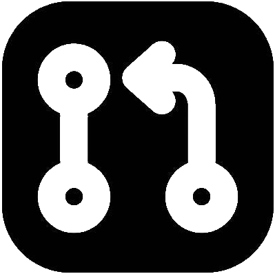
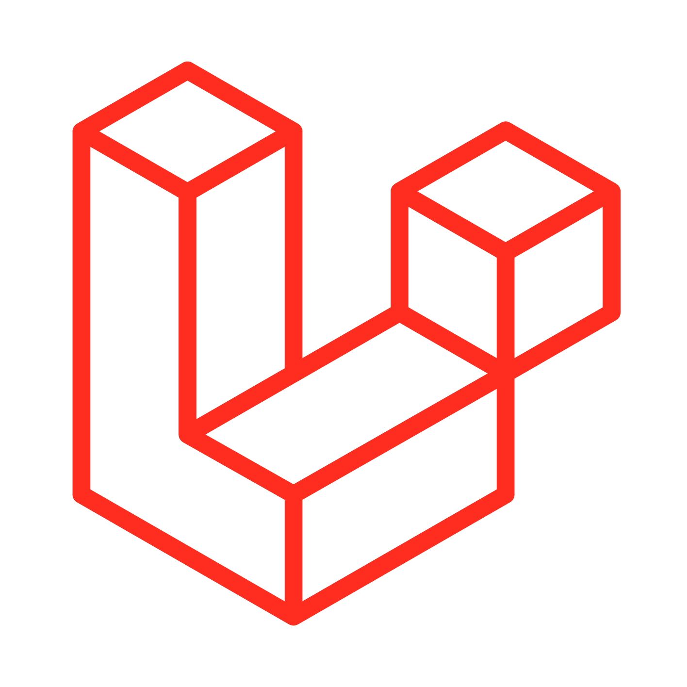
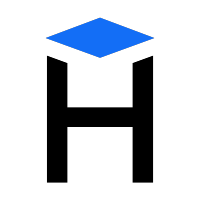

## Hi 👋 My name is Artyom
I’m a Backend developer with experience in creating web applications and server-side logic. I strive to write clean and efficient code, constantly learning new approaches and technologies.  

  

## My PRs   

  

###  laravel/framework
- https://github.com/laravel/framework/pull/56498 - Fix incorrect quote escaping in env writer.

###  laravel/pint
- https://github.com/laravel/pint/pull/398 - Added support boolean shorthand for 'cast_spaces'

###  RonasIT/laravel-entity-generator
- https://github.com/RonasIT/laravel-entity-generator/pull/170  
  ...  
  *[See all PRs](https://github.com/RonasIT/laravel-entity-generator/pulls?q=is:pr+author:artengin+is:closed)*

###  RonasIT/laravel-project-initializator
- https://github.com/RonasIT/laravel-project-initializator/pull/37  
  ...  
  *[See all PRs](https://github.com/RonasIT/laravel-project-initializator/pulls?q=is:pr+author:artengin+is:closed)*

 RonasIT/laravel-clerk - *[See all PRs](https://github.com/RonasIT/laravel-clerk/pulls?q=is%3Apr+author%3Aartengin+is%3Aclosed)*  
 RonasIT/laravel-media - *[See all PRs](https://github.com/RonasIT/laravel-media/pulls?q=is%3Apr+author%3Aartengin+is%3Aclosed)*  
 RonasIT/laravel-helpers - *[See all PRs](https://github.com/RonasIT/laravel-helpers/pulls?q=is%3Apr+author%3Aartengin+is%3Aclosed)*  
 laravelsu/laravel.su - *[See all PRs](https://github.com/laravelsu/laravel.su/pulls?q=is%3Apr+author%3Aartengin+is%3Aclosed)*  
 Hexlet/hexlet-sicp - *[See all PRs](https://github.com/Hexlet/hexlet-sicp/pulls?q=is%3Apr+author%3Aartengin+is%3Aclosed)*

## Other about me
📚 Reading books is an important part of my life.  
🎸 Playing the guitar is my passion and a way to unwind.  
🛠 In my free time, I create leather goods. I enjoy turning ideas into tangible items.
